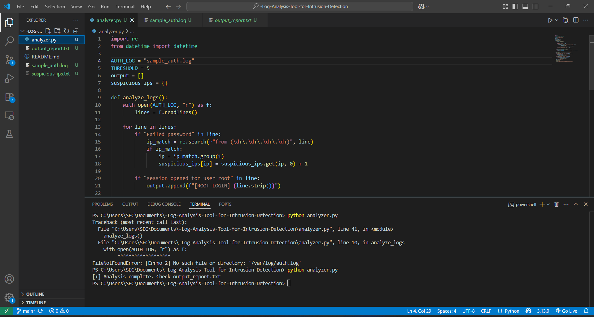
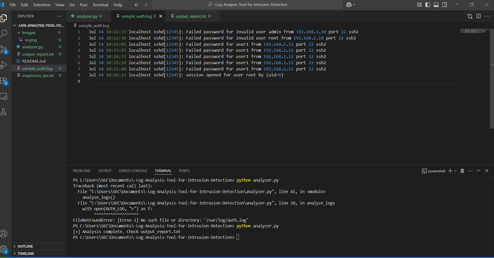
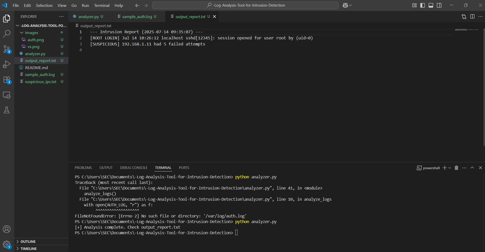

# Log-Analysis-Tool-for-Intrusion-Detection

A simple Python-based cybersecurity project to analyze Linux-style authentication logs and detect signs of unauthorized access attempts. This tool is designed for **educational purposes** and works on **Windows** using a sample log file.

##  Features

-  Detect multiple failed SSH login attempts
-  Track root user login events
-  Flag and list suspicious IP addresses
-  Generate a readable intrusion report

## File Structure

log-analyzer/
├── analyzer.py # Main log analyzer script
├── sample_auth.log # Sample log file for Windows users
├── suspicious_ips.txt # Output list of flagged IP addresses
├── output_report.txt # Summary of detected events
└── README.md # Project overview and instructions

## How It Works

The tool scans log lines for:
- `"Failed password"` → Increments a counter for each IP
- `"session opened for user root"` → Tracks any root logins

If an IP has more than 5 failed attempts, it's marked as suspicious.

## Output :

## Future Enhancements
- Real-time log monitoring using watchdog
- Email alerts for root access
- Auto-ban IPs via firewall or iptables (Linux)